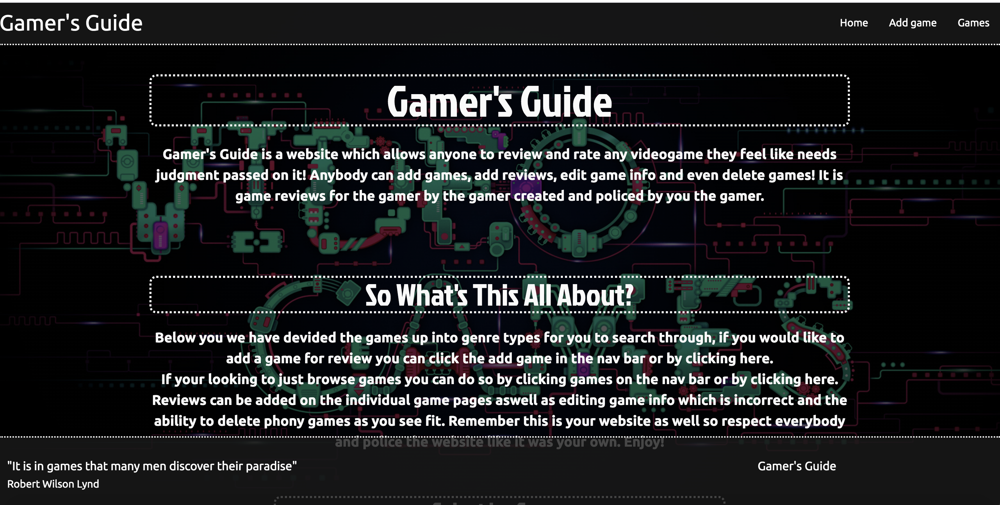
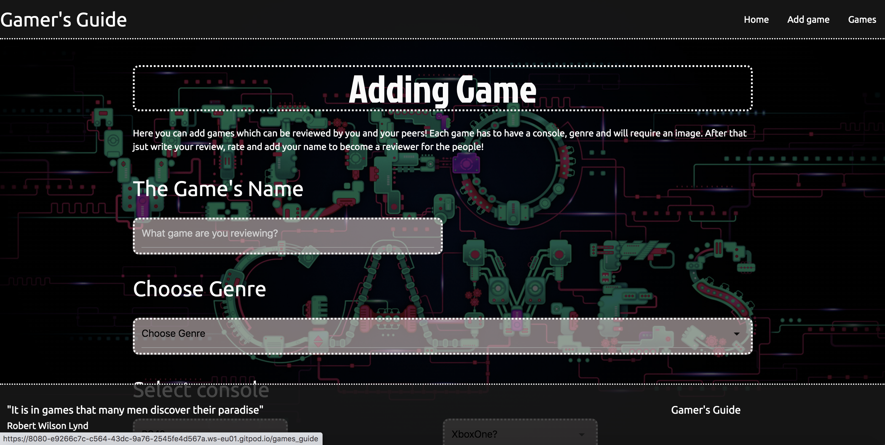
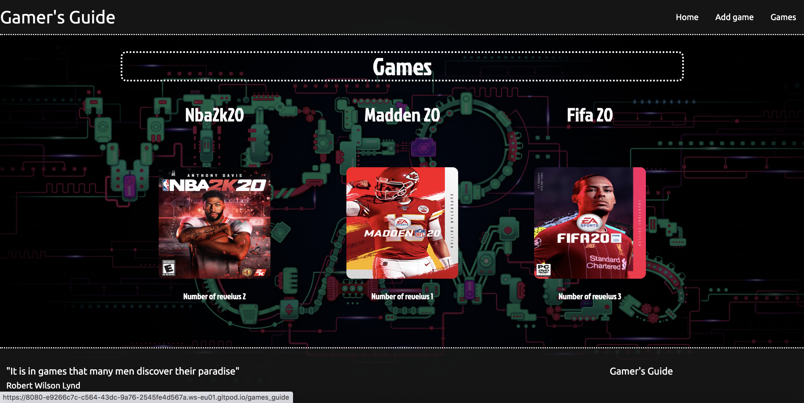
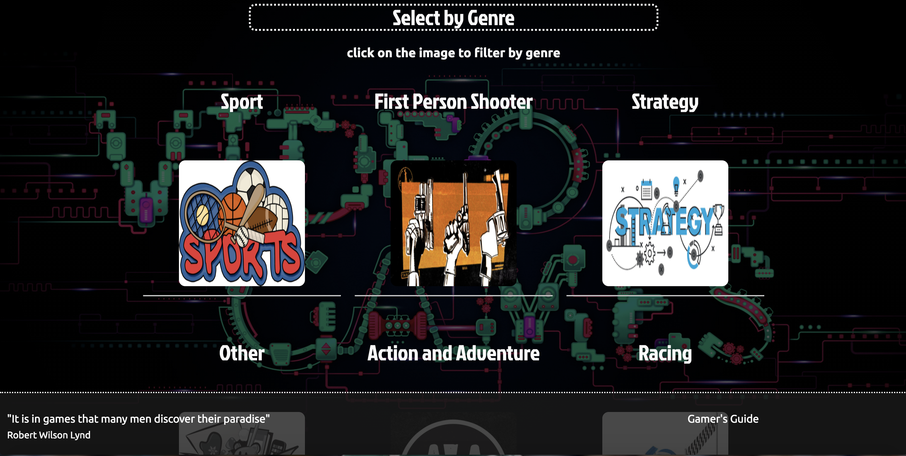
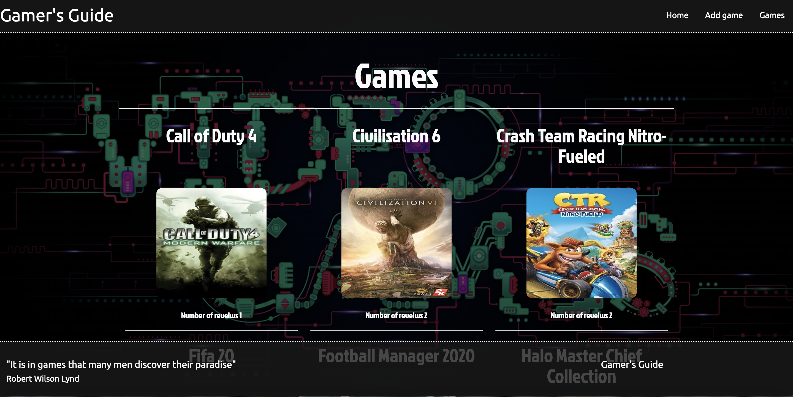
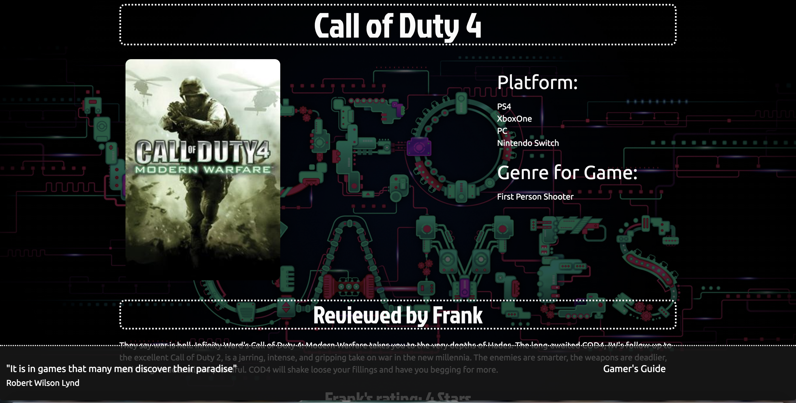
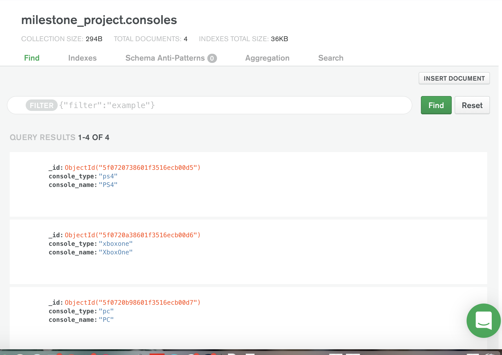
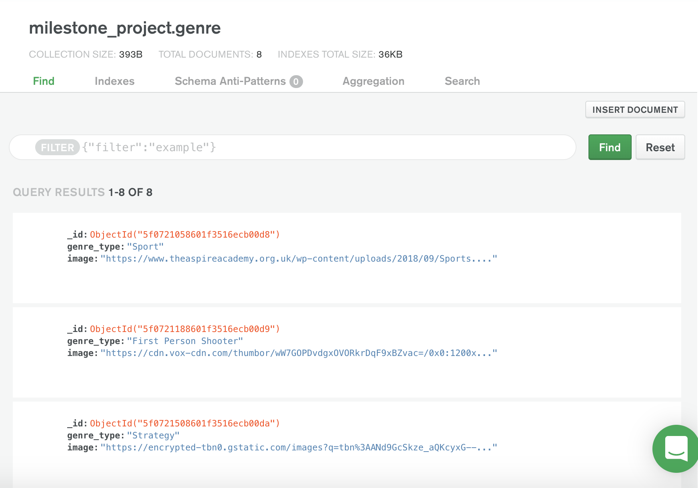
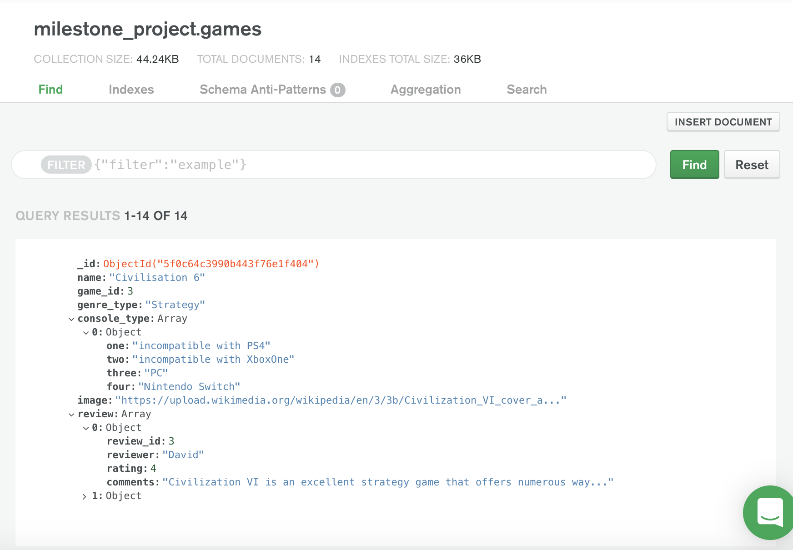

# Intro and Strategy
This website is a videogame review website, which is a free for all for users to write reviews and rate, 
add games for review and rate for fellow users to read. All games up for review will be added by users, 
information on the game updated by users and games which are fake, and have offensive material in their 
info can be deleted by users. The overall goal of the website is to provide a platform for users to be reviewers
 of their favourite game as well seeing what their fellow gamers feel about their favorite games.

#User stories

A user would want to add games to the website, they can do that by clicking the add games button on the navbar or in the intext navbar.
And then by filling the form out on the add game page.

## a)

## b)

If the user would like to look up a game and its reviews. Could do so through a search based on genre 
displayed on the home page as shown in a), or by going to the games-list page and clicking on the games listed 
alphabetically as shown in b)

## ai)

## aii)

## bi)

## bii)

# Scope 

The [landing-page](./static/images/landing-page.png) will provide an overview of the website, what it's about and what features you can find on the webpage. 
There will also be a genre based search method on the home page allowing users to select a genre of game to sort through 
the reviewed games on the website. 

The [filter genre pages](./static/images/genre-sports.png) will consist of a list of games which meet the classification of the genre selected. Example if
 you select strategy it will filter to all games that have the genre of strategy. This way the user can filter his search 
 of games through the specific genre he/she likes.

The [Add game page](./static/images/add-games.png), users can add games by filling out the asked for info in the form. By doing so they are adding a 
game and a review of it as well as allowing future users to review this game. 

The [game-lists page](./static/images/games-list.png), all games reviewed on the website are listed in alphabetical order as well as informing them 
how many reviews have been written on each game. 

The [game-page](./static/images/individual-game.png) is where a user can find the individual info on their desired game, including what consoles it works on, 
genre as well as listing all the reviews on the game. All reviews will be listed in order of when they were submitted 
and say who wrote the review, the review itself and the rating they gave. At the bottom three buttons and an explanation 
of those buttons allow users to add reviews, edit information on games and delete games. 

The [edit page](./static/images/edit-game.png) allows users to fill out a form to edit the basic info on the game. All previous info will be listed 
at the top of the page and the form below it. 

The [review page](./static/images/review-page.png) is basic enough just allows users to add a review to the existing game.

# Structure 
We have a navbar and footer with both fixed and in-text navigation on the home page. There is clear direction 
on the homepage on what the website's function is, what features it has and where to find them. The website is
 based around the ability to add games and reviews, read other people’s opinions on games as well as having the 
 functions to edit game info or remove it completely. We also want to filter games for the users  either through
  genre or alphabetically. All these features are doable with the interaction to our database on mongodb. 

## The database structure

The database has three collections, consoles, genre and most importantly games as shown below in the links. 
All three of these collections are used to filter through to provide info for the user, in terms of selected
 options in forms, providing images and filtering games. Only games whoever is able to be altered by the users
  in editing and addition. 

### Consoles collection 
there is console_type which is used for processing but console_name is used to display options 
to the user in forms.All info is in the form of strings as shown here

### Genre collection 
is used as a way of filtering the games for the user on the home page and sets a limit to how 
many types of genres can be displayed,  the user cannot add or remove gernes. Also here the images that represent those genres are stored.
All info is in the form of strings as shown here

### Games collection 
is the most important as it contains all the information on platforms, images, reviews, names etc on the games themselves. All this 
data can be altered by the user, with reviews being an array with objects within it. Everytime the user adds a review a new object
 is added to the array under review.In terms of console_type there are only four options for the users which are the four mainstream
platforms. The user can make them either compatible or not compatible and this is again done by making console_type an array with 
an object and strings within it. This is all shown here

# Skeleton
The original wireframes for the project have changed considerably due to a change in the focus of the CRUD features, as well as 
time-constraints, The difference in the original wireframes which will be attached below and the project will be explained.

[Home-page](./static/images/wireframe-home.png) --- removed the rankings of 5 star games, cluttered the page more then we had suspected, also added consoles changed
to add games as the focus of the project adjusted. Also the filter option changed from console to genre.

[Console filter page](./static/images/wireframe-console.png) --- not even in  the project this changed to a filter genre page and the layout changed to add images as we felt 
the website lacked images.

[Game-page](./static/images/wireframe-individual.png) --- same layout

[Write a review page](./static/images/wireframe-review.png) --  pretty much identical except we changed the feature of selecting the game name instead changed it to linking 
through the game-page

# Surface
Used fonts which are more blockish and have high font-weight, with dotted line borders on headers and other key features. 
Dark faded hero image along with the font choices is supposed to give a sense of classic games. 

# Features
The website has a clear navigation bar as well as in text navigation on the home page. 
The user has the full use of the CRUD functions:
### Create: 
They can add new games to the database as well as adding reviews to  those already made games
### Read:
can filter through games through the landing page’s genre filter feature, 	which displays games based on genre types, as well as this they can 
view games on the list games alphabetically and select individual games on those pages to display all info on the games. 
### Update: 
They can use the edit page to change the information on the games, for example what consoles they can be played on or the image used. 
### Delete: 
The user’s can delete games from the website.

## Future features
1) We would like to add the ability to remove individual reviews in the future, came down to time constraint, which is why the feature is not currently on the website.

2) Multiple genres would be the next feature we would add just never got around to implementing it as the changes to console choices and reviews complicated and slowed 
down the project so kept the genre_types simple for now.

3) Never added the feature of preventing games being added which had already been added to the website. Seemed simple enough in theory but could not get the function to work in time for submission.

4) Average out the ratings of each game. We would like to add the feature of listing the highest average rated games on the landing page in the future but could not get the feature implemented correctly. 

# Technologies 
1) HTML

2) CSS

3) Materialise 

4) Flask

5) Python

6) Javascript

7) Mongo db

# Testing
Display, images and links worked fine on google chrome, firefox and microsoft edge. Used W3 validator for css and html and the pep8.com to check the python was displayed up to standard. 
On each browser check we tested on mobile view(iphone 6/78), ipad view on both rotations and on general browser view. We had no notable flaws in view. With the W3 validator initially issues such as placeholders in option tags, unnecessary specification of javascript in script tags and comments with too many hyphen’s all of which were resolved. 
The pep8 test threw up issues such as under-indentation and too many whitespaces once again resolved. 

# Deployment 
The project was completed on gitpod and deployed on heroku. To connect our gitpod to heroku we first created an app which we called ‘milestone-project-db’. After this we associate the heroku app with our master repository so that we can push our work on to Heroku. For this to work we had to first create a Procfile in gitpod which is like an instructor to heroku on which files it needs to run the project. 
Once this was done we just committed the project on gitpod with regular git pushes to heroku. The website will be deployed on Heroku  Should be no difference from the deployment version or the development.

# Credits

Most reviews which were entered on the original game enterys came from metric video game review. A link to theri website [here](https://www.metacritic.com/game) 

Some reviews came form google reviews aswell which appears when googling the game. 

# Acknowledgements
W3s school was leaned on heavily for helping put together this website especially the navbar, button and images positioning and footer positioning. A link to their website is [here](https://www.w3schools.com/default.asp) 

Stack Overflow was also a tool used for info especially sorting out general bugs and gltiches throughout the project [here](https://stackoverflow.com/)

Mongodb documentation was also leaned on heavily on for updating game info in terms of adjusting array info in console_type. A link to the website [here](https://docs.mongodb.com/manual/reference/operator/update/push/)

The Jinja documentation website content was used for filters like length and for putting together the gerne filter search. A link to the website [here](https://jinja.palletsprojects.com/en/2.11.x/)

# media
 
Most images where picked up from their wikipedia for games that where entered but some where off random google searches.

The hero image came from th amazing science news website. 